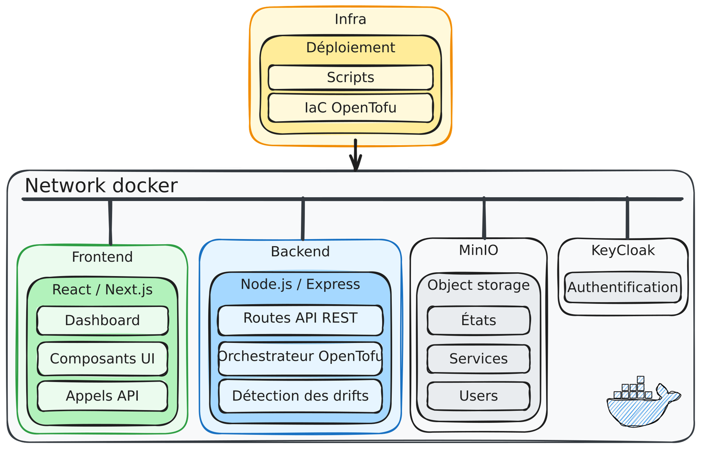
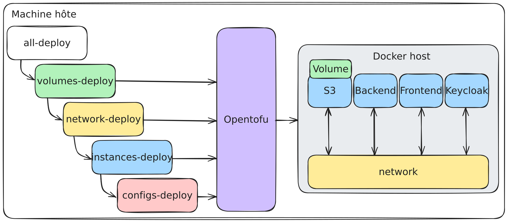
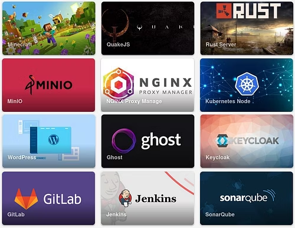

# SpawnIT


**Infrastructure-as-Code made accessible**

Deploy and destroy technical services with a single click, without writing a single line of Terraform code.

[](https://opentofu.org/)
[](https://nodejs.org/)
[](https://nextjs.org/)

---

## Overview

SpawnIT is a Platform-as-a-Service built on top of **OpenTofu** (the open-source community fork of Terraform). It provisions complete services—databases, game servers, DevOps platforms—through a simple web interface.

### Core Concept

> *Describe the desired state, not the procedure to achieve it*

SpawnIT implements a dual approach:

1. **IaC Layer**: The platform deploys itself using OpenTofu through shell scripts and reusable modules
2. **API-First**: Users interact solely with a REST API—no Terraform knowledge required

## Features

- **Service Catalog**: Minecraft, Rust, QuakeJS, WordPress, Ghost, GitLab, Jenkins, SonarQube, NGINX, Kubernetes Node, MinIO
- **SSO Authentication**: Keycloak integration with OpenID Connect
- **Full Orchestration**: Automatic management of Docker networks, volumes, and configurations
- **Real-time Monitoring**: Deployment tracking via Server-Sent Events (SSE)
- **Multi-target**: Docker local and AWS EC2 support
- **Centralized State**: S3 (MinIO) storage for all OpenTofu states
- **Modern UI**: Intuitive React/Next.js dashboard

## Architecture



### Infrastructure Deployment



### Tech Stack

| Component | Technology | Port | Purpose |
|-----------|------------|------|---------|
| **Frontend** | Next.js 15 + React 19 | 3000 | User interface |
| **Backend** | Node.js + Express | 3001 | REST API + OpenTofu orchestrator |
| **Auth** | Keycloak 24 | 8080 | SSO and user management |
| **Storage** | MinIO | 9000 | S3 storage for states and configs |

### Application Screenshot



## Quick Start

### Prerequisites

- **Docker** and **Docker Compose**
- **OpenTofu** 1.6+ ([Installation guide](https://opentofu.org/docs/intro/install/))
- **Git**
- Available ports: 3000, 3001, 8080, 9000

### Installation

```bash
# Clone the repository
git clone https://github.com/spawn-it/backend.git spawnit
cd spawnit/infra

# Deploy the complete infrastructure
chmod +x all-deploy.sh
./all-deploy.sh
```

**Note**: All deployment commands must be run from the `./infra` directory.

Deployment takes approximately 2-3 minutes with a 20-second delay between each step for proper initialization.

### Keycloak Initialization

If Keycloak isn't fully initialized during the first deployment, some configurations may fail:

```bash
# Wait ~30 seconds and re-run
./all-deploy.sh

# If backend has an invalid Keycloak singleton
docker restart spawn-it-backend
```

### Access Points

- **Frontend**: http://localhost:3000
- **Backend API**: http://localhost:3001
- **Keycloak**: http://localhost:8080
- **MinIO Console**: http://localhost:9000

Default credentials are in `infra/configs/users.auto.tfvars.json`

## Project Structure

```
spawnit/
├── backend/              # Node.js API + OpenTofu orchestrator
│   ├── routes/           # REST endpoints (catalog, template, opentofu)
│   ├── services/         # Business logic
│   │   ├── executor/     # OpenTofu execution
│   │   ├── manager/      # Instance, job, and drift detection
│   │   └── s3/           # MinIO interactions
│   ├── opentofu/         # Terraform modules for user services
│   └── sse/              # Server-Sent Events for real-time updates
│
├── frontend/             # Next.js interface
│   ├── src/
│   │   ├── app/          # Pages (dashboard, deploy)
│   │   ├── components/   # Reusable React components
│   │   ├── context/      # Auth & Theme providers
│   │   └── services/     # API clients
│   └── public/           # Static assets
│
└── infra/                # Infrastructure-as-Code
    ├── configs/          # Keycloak & MinIO configuration
    ├── instances/        # Application container deployment
    ├── network/          # Docker network
    ├── volumes/          # Persistent volumes
    ├── modules/          # Reusable OpenTofu modules
    │   ├── common/
    │   │   ├── configs/  # IDP (Keycloak) & S3 (MinIO)
    │   │   └── docker/   # Instances, network, volumes
    └── doc/              # Complete documentation
```

## Deployment Phases

The `all-deploy.sh` script orchestrates 4 distinct phases (run from `./infra` directory):

```bash
# 1. Persistent volumes
./volumes-deploy.sh   # MinIO and Keycloak volumes

# 2. Docker network
./network-deploy.sh   # Bridge network for all containers

# 3. Application instances
./instances-deploy.sh # Backend, Frontend, Keycloak, MinIO

# 4. Service configuration
./configs-deploy.sh   # S3 buckets, Keycloak realms, users
```

### Modularity Benefits

- **Idempotence**: Each step can be re-run without side effects
- **Modularity**: Modify parts without redeploying everything
- **Clear Dependencies**: Respects OpenTofu DAG
- **CI/CD Ready**: Easy pipeline integration

## Available Services

| Category | Services |
|----------|----------|
| **Gaming** | Minecraft, Rust, QuakeJS |
| **CMS** | WordPress, Ghost |
| **DevOps** | GitLab, Jenkins, SonarQube |
| **Web** | NGINX Proxy Manager |
| **Cloud** | MinIO (Object Storage), Kubernetes Node |
| **Auth** | Keycloak |

Each service is defined in a JSON template and deployed via specialized OpenTofu modules.

## Development

### Backend

```bash
cd backend
npm install
npm start       # Start development server
npm run lint    # Run linter
npm run format  # Format code
```

### Frontend

```bash
cd frontend
npm install
npm run dev        # Start with Turbopack
npm run build      # Production build
npm run lint:fix   # Lint and fix
npm run format     # Format code
```

## REST API

### Main Endpoints

```http
# Service catalog
GET /api/catalog

# Deployment templates
GET /api/template/:service
POST /api/template

# OpenTofu management
POST /api/opentofu/plan
POST /api/opentofu/apply
POST /api/opentofu/destroy
GET /api/opentofu/status/:jobId

# Real-time updates
GET /api/events
```

## Documentation

- **[Complete Documentation](../../infra/doc/template.md)** - Detailed architecture and concepts
- **[Infrastructure Guide](../../infra/README.md)** - OpenTofu modules and deployment
- **[Backend API](../../backend/README.md)** - Endpoint documentation
- **[Frontend](../../frontend/README.md)** - Components and services

## Authors

- **Massimo Stefani**
- **Timothée Van Hove**

Project developed as part of the PLM course at HEIG-VD.

---

<div align="center">

Made with OpenTofu ❤️

</div>
